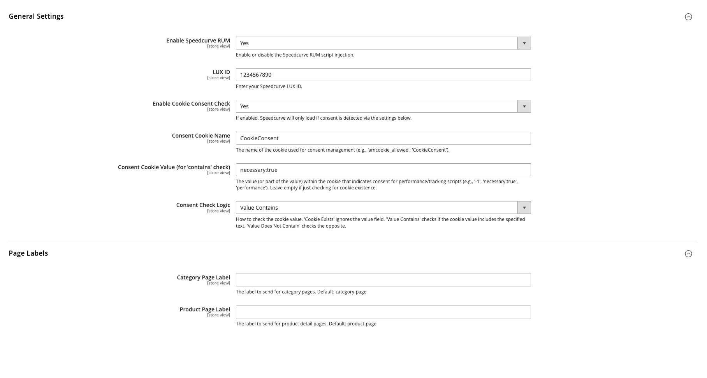

# Bluebirdday Speedcurve Magento 2 Module

## Overview

This Magento 2 module integrates the Speedcurve Real User Monitoring (RUM) service, specifically the LUX script, into your Magento store. It is designed for standard Magento 2 frontend themes (Luma-based or custom themes using Layout XML, RequireJS, etc.).

The module allows you to:
- Automatically inject the Speedcurve LUX JavaScript snippet onto your pages.
- Send specific page labels to Speedcurve for better analysis (e.g., 'category-page' for category views, 'product-page' for product views).
- Configure all settings via the Magento Admin Panel, including LUX ID, page labels, and cookie consent handling.

## Features

- **Speedcurve RUM Integration:** Injects the necessary Speedcurve LUX JavaScript.
- **Configurable LUX ID:** Set your unique Speedcurve LUX ID via admin configuration.
- **Configurable Page Labels:** Define custom labels sent to Speedcurve for category and product pages via admin configuration (defaults provided).
- **Standard Magento Compatibility:** Uses Layout XML, Blocks, phtml templates, RequireJS, and jQuery for integration.
- **Flexible Cookie Consent:**
    - Option to enable/disable cookie consent check.
    - Configure the specific cookie name used by your consent manager.
    - Configure the value (or part of a value) within the cookie that signifies consent.
    - Choose the logic for checking the cookie (existence, value contains, value does not contain).



## Requirements

- Magento 2 (e.g., 2.3.x, 2.4.x)
- Standard Magento 2 Theme (Luma-based or custom using default frontend stack)

## Installation

Install the module via Composer:

```bash
# Replace bluebirdday/module-speedcurve with the actual package name if different
composer require bluebirdday/speedcurve-magento
bin/magento module:enable Bluebirdday_SpeedcurveMagento
bin/magento setup:upgrade
bin/magento cache:flush
```

*(Note: If installing on a production environment, you will likely need to run `setup:di:compile` and `setup:static-content:deploy <locales>` as per standard Magento deployment procedures).* 

## Configuration

After installation, configure the module in the Magento Admin Panel:

1.  Go to **Stores > Configuration > Bluebirdday > Speedcurve**.
2.  **General Settings:**
    *   **Enable Speedcurve RUM:** Yes/No - Master switch for the module.
    *   **LUX ID:** Enter your unique ID provided by Speedcurve. **Required** if enabled.
    *   **Enable Cookie Consent Check:** Yes/No - Choose whether to check for consent before loading the script.
    *   **Consent Cookie Name:** (Only if consent check enabled) The name of the cookie your consent tool uses (e.g., `CookieConsent`, `amcookie_allowed`). **Required** if consent check enabled.
    *   **Consent Cookie Value:** (Only if consent check enabled) The text value (or part of it) inside the cookie that indicates consent (e.g., `performance`, `necessary:true`, `-1`). Leave empty if checking only for cookie existence with the 'Cookie Exists' logic.
    *   **Consent Check Logic:** (Only if consent check enabled) How to interpret the cookie:
        *   `Cookie Exists`: Loads script if the cookie name exists. Ignores value.
        *   `Value Contains`: Loads script if the cookie name exists AND its value contains the text in "Consent Cookie Value". If the value field is empty, this behaves like `Cookie Exists`.
        *   `Value Does Not Contain`: Loads script if the cookie name exists AND its value does NOT contain the text in "Consent Cookie Value". If the value field is empty, this check will always fail.
3.  **Page Labels:**
    *   **Category Page Label:** The label sent on category pages (default: `category-page`).
    *   **Product Page Label:** The label sent on product detail pages (default: `product-page`).
4.  Save the configuration.

## Usage

Once installed, enabled, and configured with your LUX ID (and potentially cookie consent settings), the module works automatically:

- The layout XML (`default.xml`, `catalog_category_view.xml`, `catalog_product_view.xml`) adds blocks to the page.
- These blocks render phtml templates containing `text/x-magento-init` scripts.
- These scripts initialize the RequireJS modules (`bluebirddaySpeedcurveRum` and `bluebirddaySpeedcurvePageLabel`).
- `bluebirddaySpeedcurveRum.js` checks cookie consent (if configured) and injects the Speedcurve LUX scripts.
- `bluebirddaySpeedcurvePageLabel.js` waits for the main script to load (using a jQuery event `SpeedcurveLoaded`) and then sets the configured `LUX.label`.

You can monitor your Speedcurve RUM dashboard to see data coming in, including the page labels.

## License

MIT License

See the [LICENSE](LICENSE) file for details. 